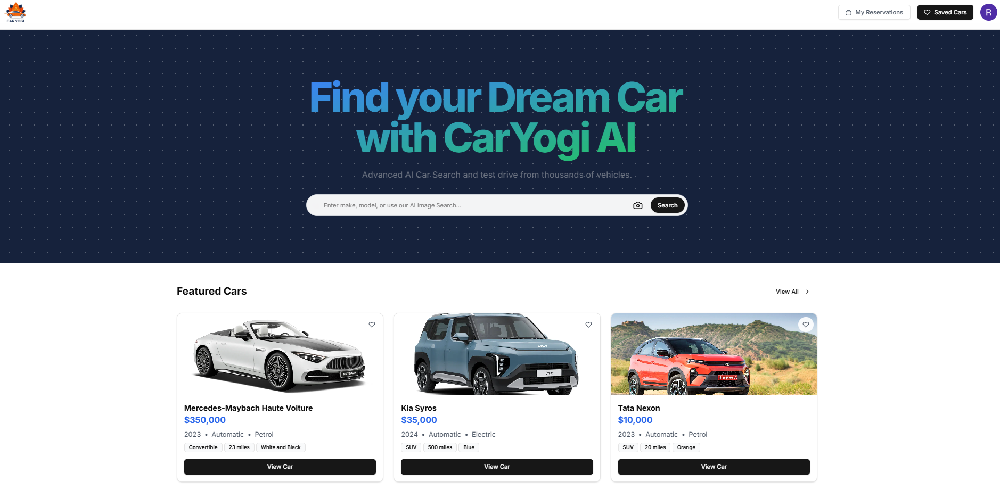
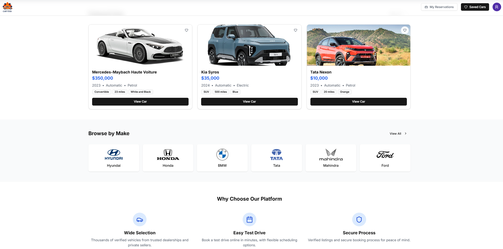
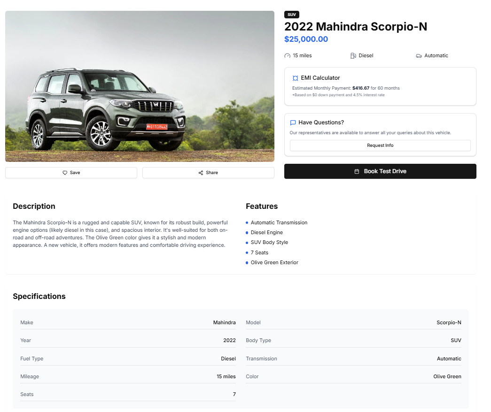
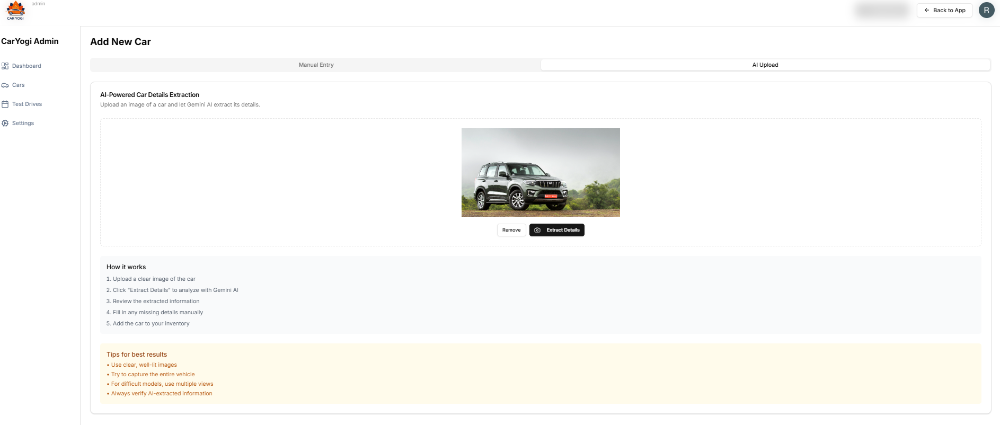
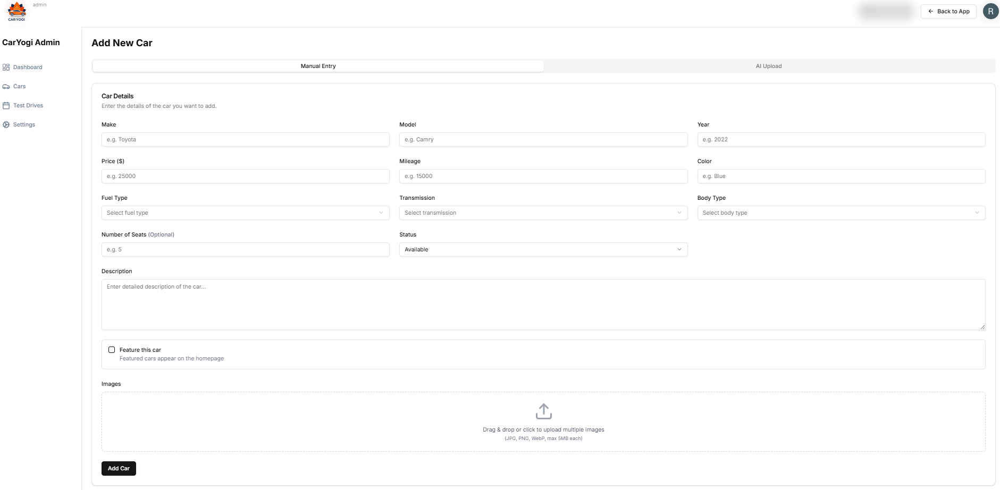
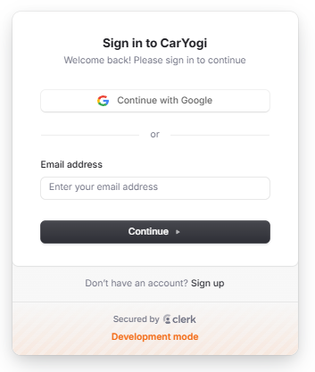
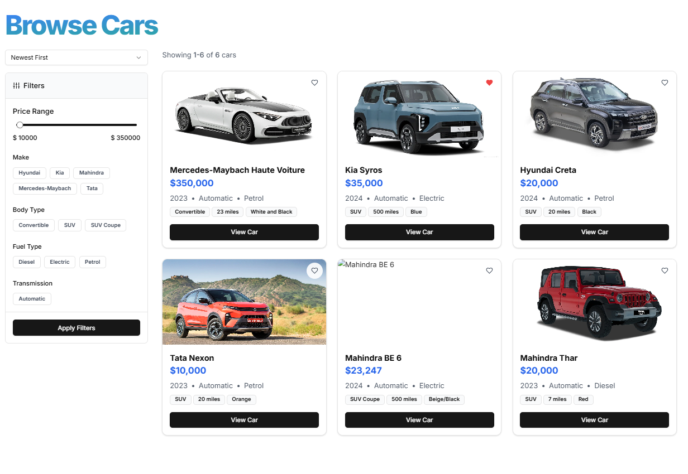
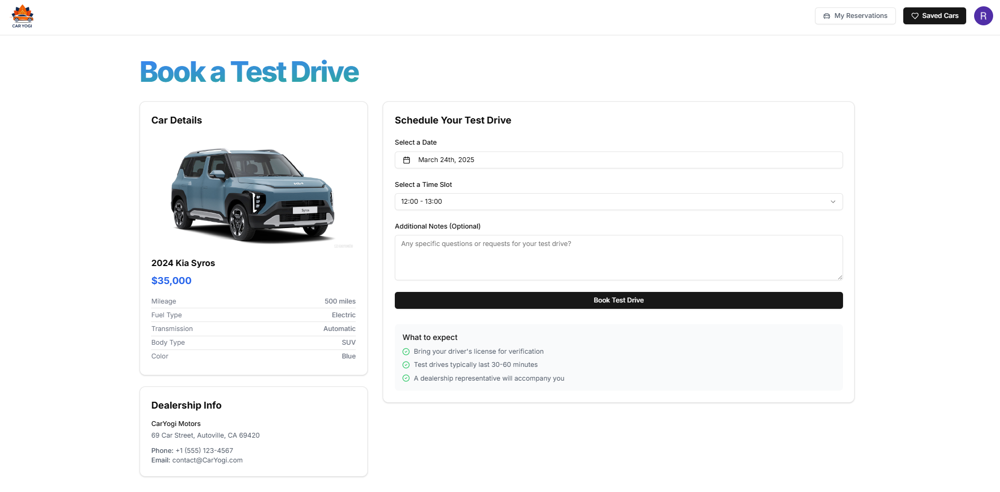
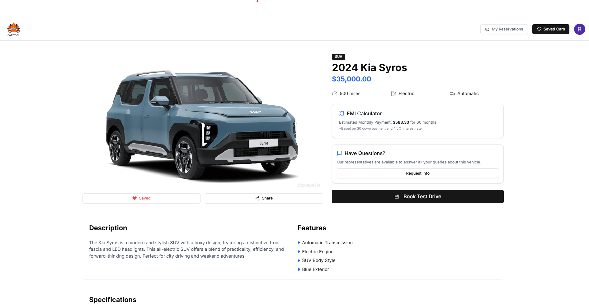

# 🚗 CarYogi AI - Smart Car Marketplace

CarYogi AI transforms how people find and purchase vehicles by combining advanced artificial intelligence with an intuitive marketplace platform. Our solution helps users discover their ideal car through smart recommendations, conversational search, and a frictionless booking system for test drives.

## 🎯 Key Features

### 🤖 AI-Powered Search
- **Smart Recommendations** - Tailored vehicle suggestions based on preferences and behavior
- **Natural Language Processing** - Search using everyday language instead of complex filters
- **Personalized Results** - Results that improve with usage and learn from user interactions

### 👤 User Experience
- **Secure Authentication** - Protected accounts with multi-factor options
- **Personalized Dashboards** - Custom interface showing relevant vehicles and saved searches
- **Favorites & Collections** - Save and organize vehicles of interest
- **Seamless Scheduling** - Book test drives with just a few clicks

### 💼 Dealer Portal
- **Inventory Management** - Easily upload and update vehicle listings
- **Lead Management** - Track and engage with potential buyers
- **Performance Analytics** - Comprehensive insights on listing performance
- **Automated Responses** - AI-powered responses to common customer inquiries

## 🛠 Tech Stack

### Frontend
| Technology      | Purpose                                  |
|-----------------|------------------------------------------|
| **Next.js 13+** | React framework with server components   |
| **React 18**    | UI library for interactive components    |
| **Tailwind CSS**| Utility-first styling approach           |
| **Lucide React**| Modern, consistent icon system           |
| **Clerk**       | Complete auth and user management        |

### Backend
| Technology       | Purpose                                     |
|------------------|---------------------------------------------|
| **PostgreSQL**   | Relational database for structured data     |
| **Supabase**     | Managed database with realtime capabilities |
| **Prisma**       | Type-safe ORM for database interactions     |
| **Google Gemini**| Advanced AI for recommendations and NLP     |

## 📸 Screenshots

<table>
  <tr>
    <td><strong>Home Screen</strong></td>
    <td><strong>Home Screen 2</strong></td>
  </tr>
  <tr>
    <td></td>
    <td></td>
  </tr>
  <tr>
    <td><strong>View Car</strong></td>
    <td><strong>Add New Car AI</strong></td>
  </tr>
  <tr>
    <td></td>
    <td></td>
  </tr>
  <tr>
    <td><strong>Add New Car</strong></td>
    <td><strong>Admin Dashboard</strong></td>
  </tr>
  <tr>
    <td></td>
    <td></td>
  </tr>
  <tr>
    <td><strong>Sign In</strong></td>
    <td><strong>Browse Cars</strong></td>
  </tr>
  <tr>
    <td></td>
    <td></td>
  </tr>
  <tr>
    <td><strong>Test Drive Booking</strong></td>
    <td><strong>User Profile</strong></td>
  </tr>
  <tr>
    <td></td>
    <td></td>
  </tr>
</table>

## 📁 Project Structure
``` bash
CarYogi/
├── app/                    # Next.js application directory
│   ├── components/         # Reusable UI components
│   │   ├── car-card/       # Vehicle display components
│   │   ├── home-search/    # Search interface components
│   │   └── ui/             # Common UI elements
│   ├── api/                # API routes and handlers
│   └── page.js             # Main page component
├── prisma/                 # Database schema and migrations
│   └── schema.prisma       # Prisma schema definition
├── public/                 # Static assets
│   ├── images/             # Image resources
│   └── icons/              # Icon assets
├── lib/                    # Utility functions and data handlers
│   ├── data.js             # Data fetching and manipulation
│   └── utils.js            # Helper functions
└── config/                 # Application configuration
└── site.config.js          # Site-wide configuration
```


## 🚀 Getting Started

### Prerequisites
- Node.js 16.x or later
- npm or yarn package manager
- PostgreSQL database

### Installation Steps

1. **Clone the repository**
   ```bash
   git clone https://github.com/yourusername/caryogi.git
   cd caryogi
## ⚙️ Configuration

### Authentication (Clerk)
NEXT_PUBLIC_CLERK_PUBLISHABLE_KEY=your_publishable_key
CLERK_SECRET_KEY=your_secret_key

### Database (Supabase)
DATABASE_URL=your_database_url
DIRECT_DATABASE_URL=your_direct_url

### AI Integration
GEMINI_API_KEY=your_gemini_api_key

